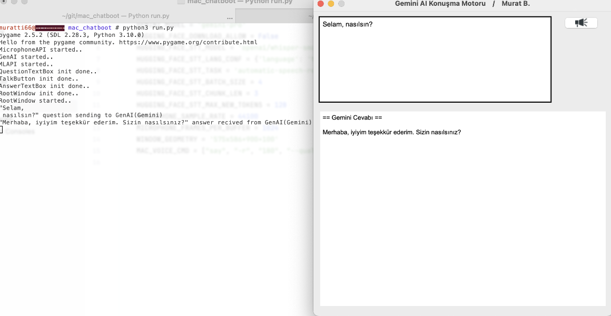

## Gemini Chat Programı

### Giriş

Yapayzeka ile sesli iletişim kurmak bir çoğumuzun hayaliydi. Bu işlevi yapabilmek için sırasıyla Mikrafon iletişimi, Speech to Text, alınan metnin AI'da yorumlanması, AI'dan alınan verinin Text to Speech ile sese çevirilmesi ve son aşamada bilgisayar tarafından oynatılması yöntemi ile yapılabileceğini kararlaştırdım.<p>
Bende bu arzu üzerine kafa yorarken Google tarafından ücretsiz olarak sunulan GenAI apisiyle karşılaştım böylelikle AI tarafı tamamlamıştım. <p>
Hemen sonrasında araştırmalar sonucu Open AI'ın hugging face üzerinde olan ücretsiz speech to text modeli ile karşılaştım. Birkaç deneme sonrası "whisper-small" modelin düşük kaynak tüketimi ve sağlıklı çalışma olarak aslında hiçde fena olmayacak şekilde olduğunu farkettim.<p>
Son olarakda Mac OS üzerinde bulunan "say" komutunu kullanmak sureti ile yapıyı tamamladım.
Fakat cross platform olarak (tüm işletim sistemlerinde) çalışabilmesi için python speech to text ve pygame ses oynatıcı modüllerini ekleyerek os bağımlılığını kaldırdım.<p>
Programı tamamladıktan sonra günlük hayatta çokca kullanmaktayım ve herkesin kullanabilmesi ve üzerindeki modüllerden istifade edebilmesi için github'ıma attım.<p>
Umarım faydasını görürsünüz.. ve sorular yada katkıda bulunmak isterseniz pull request üzerinden case açmaktan çekinmeyin.

### Ekran Görüntüsü




### Genel Özellikler
* Basit, kolay ve kestirmelerle pratik hale getirilmiş bir arayüz kullanır.
* Uygulama ile satır destekli olarak girilen yazıyı gemini ye gönderir ve alınan cevapları satır destekli olarak alt kısımdaki pencerede yayınlar. (satır desteği paste işlemi ile sağlanır.)
* Mikrafon işaretine basılı tutulduğunda alınan sesli bilgiyi yazıya çevirerek geminiye gönderir alınan cevabı yine sesli olarak bilgisayar üzerinde oynatarak yanıtlar.
* CTRL+S ile alınan metinsel cevabı sesli cevaba dönüştürür.

### Altyapı
* Python3 interpretter
* Python tkinter ile basit ve az kaynak tüketen pencere paketi
* Hugging face whisper-small sesden metine dönüştürme ai modeli (https://huggingface.co/openai/whisper-small)
* Python google-generativeai (genai) gemini ile api iletişimi paketi
* Python pyaudio ve pygame mikrafon ve ses işlemleri paketleri
* Python text-to-speech metinden sese dönüştürme paketi

### Gereksinimler
* Python3.10 ve üstü interpretter
* 1 GB ve üstü disk alanı
* Gemini Console üzerinden API anahtarı edinilmesi. (https://aistudio.google.com adresinden Get Api Key ile, ücretsiz..)

### Kurulum ve Kullanım
* git clone ile projeyi indirin
* Terminal/shell açıp aşağıdaki python pip3 modül yöneticisi ile gereksinimleri yükleyin
```
cd [proje path'i]
pip3 install -r requirements.txt
```
* Gemini erişimi için API key düzenlemesi [proje path'i]/conf/config.py dosyası içerisinde GEMINI_API_KEY = ******** ait değer ile yapılır. Aldığınız key ile ******** kısmını güncelleyiniz.
* Uygulama penceresinde kendi adınızı kullanmak için [proje path'i]/conf/static.py içerisinde StaticValues sınıfında AUTHOR kısmını düzenleyebilirsiniz. <b>Sadece kişisel kullanımlar içindir.</b>
* Gereksinimler yüklendikten sonra kullanıma hazırdır. 
```
python3 run.py
```
* <b>Not:</b> Hugging face "whisper-small" modeli indirilmelidir. Ben her çalıştırmada model sürüm sorgulaması yapmasın diye bunu kapattım. İlk çalıştırmada aşağıdaki parametre ile güncelleme sağlayabilirsiniz:
```
python3 run.py --first-run
```
* Açılan uygulamada "Yazılı soruyu yazınız.." kısmı yapay zeka ile konuşacağınız bölümdür. Yazıyı silip istediğiniz sorunuzu ve enter'a basın, cevap kısa sürede dönecektir. Ek olarak bu kısım büyüktür gerektiğinde kod bloğu yapıştırabilir ve sorabilirsiniz.
* Gelen cevapta COMMAND + S yapıldığında (Mac dışında karşılığı Ctrl + S) alınan cevap sesli olarak okunacaktır.
* Uygulamada ses buttonuna basılı tuttuğunuz süre boyunca konuşabilirsiniz bunu yazıya çevirerek yapay zekaya yollar ve cevabını sesli alarak size cevabı okur ve soru ve cevap kısmını metinler ile doldurur.


#### Notlar
* Uygulama kullanırken önce mikrafon izni verdiğinizden emin olun.
* Uygulama terminalden kullanıldığı taktirde print ile basitçe debug output vermektedir. Hata alırsanız buradan hangi aşamada olduğunu gözlemleyibilirsiniz.
<p>


#### * Uygulama kişisel kullanım içindir..
#### Lisans: MIT.